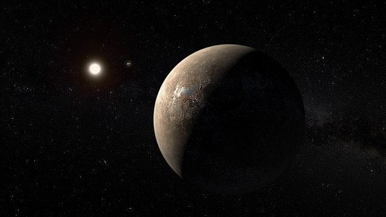

# Proxima B News Network

Proxima B is a possibly earth like planet that orbits Proxima Centauri,
closest star to our sun. If humans had a colony in Proxima B today, they
would receive news from Earth 4.2 years late due to its distance.

Since Proxima B is 4.2 light years away, it takes light 4.2 years to
make this journey, as light is the fastest thing in our universe,
our communication speed is also limited by 4.2 years.

[Proxima B News Bot](https://twitter.com/ProximaBNewsBot) is a small
Twitter bot that shares news[^1] with this time delay.

Cover and social pictures by ESO/M. Kornmesser - https://www.eso.org/public/images/ann16056a/, CC BY 4.0, https://commons.wikimedia.org/w/index.php?curid=50869082

[^1]:
    For full disclosure, since certain news categories are targets of
    targeted disinformation, certain topics such as armed conflict and
    international politics is automatically filtered out, I am not happy
    with this either, but I don't want to inadvertantly spead targeted
    disinformation.
